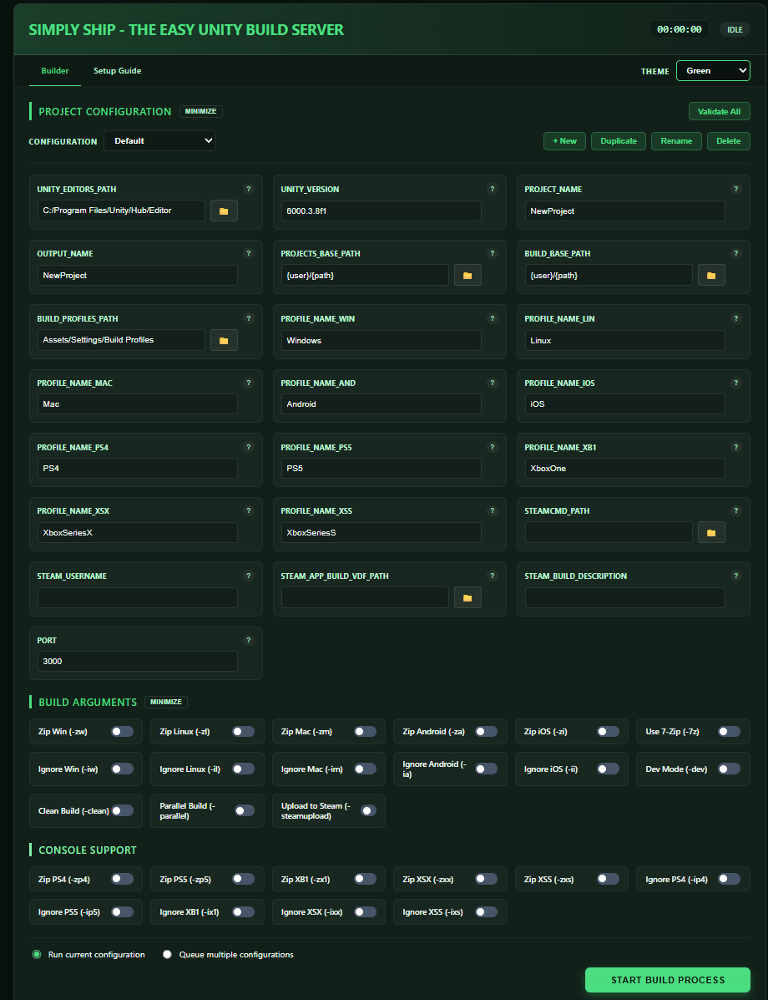

# Simply Ship - The Easy Unity Build Server


**Simply Ship** is a lightweight, portable, and automated build system designed to simplify the headache of Unity multi-platform deployments. It provides a clean web interface to manage headless builds across five major platforms simultaneously.



---

## 🚀 Key Features

- **Multi-Platform Support**: Built-in configurations for Windows, Linux, Mac, Android, and iOS.
- **Multi-Configuration Management**: Store any number of named configurations in a single, human-readable `build_config.txt`. Switch between them, duplicate, or rename them right from the web UI.
- **Build Queueing**: Queue up multiple configurations to build back-to-back in a chosen order, unattended.
- **Steam Integration**: Battle tested and dogfooded at my own studio to work smoothly with Steam.
- **Portable Executable**: No development environment required on your build machine. Just run the standalone `SimplyShip.exe`.
- **Headless Builds**: Fully automated builds using Unity's `-batchmode` and `-nographics`.
- **Parallel Processing**: Kick off builds for multiple platforms at once.
- **Smart Zipping**: Automatic packaging of build artifacts with cross-platform extraction compatibility.
- **Live Logs**: Real-time log streaming from Unity directly to your browser.
- **Validation**: Integrated folder and configuration checking to catch errors before you build.

---

## ✅ Availability

Simply Ship is fully unrestricted. All build features, including parallel builds, are available to every user.

---

## 🚀 Quick Start Guide

Simply Ship automates headless Unity builds. Instead of opening Unity and switching platforms (which triggers slow asset re-imports), Simply Ship expects you to have a cloned copy of your project for every platform you intend to build. It then triggers Unity's command-line interface to build each of these projects in the background.

### 1. How it Works
Simply Ship leverages Unity's command-line interface to trigger builds in the background across multiple project clones, ensuring you never have to wait for platform switching again.

### 2. Organizing Your Folders
Choose a single directory on your machine to be your `PROJECTS_BASE_PATH`. Inside this folder, you should have a separate cloned git repository for each platform.

#### Folder Naming Convention
Folders must be named as: `[ProjectName][Platform]` or `[ProjectName][Platform]Dev`

- **Windows**: `SpookerWindows` & `SpookerWindowsDev`
- **Linux**: `SpookerLinux` & `SpookerLinuxDev`
- **Android**: `SpookerAndroid` & `SpookerAndroidDev`

**Automatic Skipping:**
If the system cannot find a folder for a specific platform (e.g., `SpookerMac` is missing), it will simply ignore that platform during the build process.

### 3. Unity Build Profiles
Inside your Unity projects, you must use **Build Profiles** (the `.asset` files introduced in newer Unity versions). Simply Ship relies on these profiles to know exactly what scenes and settings to use.

#### Profile Naming Requirements
The system looks for specific filenames inside your `BUILD_PROFILES_PATH`:

- **Production**: `Windows.asset`, `Linux.asset`, `Android.asset`, etc.
- **Development** (`-dev` flag): `WindowsDev.asset`, `LinuxDev.asset`, `AndroidDev.asset`, etc.

*Note: The "Windows", "Linux" etc. parts are defined by your `PROFILE_NAME_XXX` settings in the config.*

### 4. Managing Configurations
`build_config.txt` can hold any number of named configurations — handy if you build multiple projects, or just want separate Dev/Production setups, from the same Simply Ship instance. The file stays a single, plain-text, easy-to-diff-and-share file; each configuration just lives under its own `[ConfigName]` section:

```ini
ACTIVE_CONFIG=Spooker

[Spooker]
UNITY_EDITORS_PATH=...
PROJECT_NAME=Spooker
...

[SpookerDev]
UNITY_EDITORS_PATH=...
PROJECT_NAME=SpookerDev
...
```

On the Builder page, the **configuration dropdown** at the top of the settings panel lets you:
- **Switch** between saved configurations — the form (and `ACTIVE_CONFIG`) updates instantly.
- **+ New** a blank configuration, or **Duplicate** the current one as a starting point.
- **Rename** or **Delete** a configuration.

Any field you edit is always saved to whichever configuration is currently active, so you never have to worry about overwriting the wrong setup.

> **Upgrading from an older version?** If your existing `build_config.txt` doesn't yet use `[ConfigName]` sections, Simply Ship migrates it automatically the first time it's read — your settings are wrapped in a single section and nothing is lost.

### 5. Queueing Multiple Builds
Before starting a build, choose how you want it to run:
- **Run current configuration** — the standard, single-configuration build.
- **Queue multiple configurations** — pick any number of saved configurations, arrange them in order, and Simply Ship will build each one to full completion (Unity build, zipping, optional Steam upload) before starting the next. Handy for shipping several projects, or Dev + Production builds, unattended in one sitting.

The queue can be reordered or removed from before you start, and **Cancel Build** will stop the entire queue, not just the build currently in progress.

### 6. Pre-Build Checklist
- **Switch Platforms**: Each project folder must already be set to its target platform in Unity. Simply Ship will not switch platforms for you.
- **Branch Management**: Each folder must be checked out to the git branch you want to build. Simply Ship will not change branches for you.
- **Validate**: Use the **"Validate All"** button on the Builder page to ensure your paths and Unity versions are correctly recognized before starting.

### 7. REST API (Remote Trigger)
You can trigger a build from a script or CI/CD pipeline by sending a POST request. It will use the settings currently saved in your **active** configuration.

```bash
curl -X POST http://localhost:3000/build
```

**Monitoring**: The API returns immediately. You can monitor progress by keeping the web UI open (it will sync automatically) or by checking `build.log`.

---

## ⚖️ Legal

&copy; Copyright Daniel Serebro 2026

**This project is not affiliated with, sponsored by, or endorsed by Unity Software Inc.** "Unity" is a registered trademark of Unity Software Inc.

Simply Ship is provided as-is without warranty of any kind.

---

Built with ❤️ for the Unity Community.
